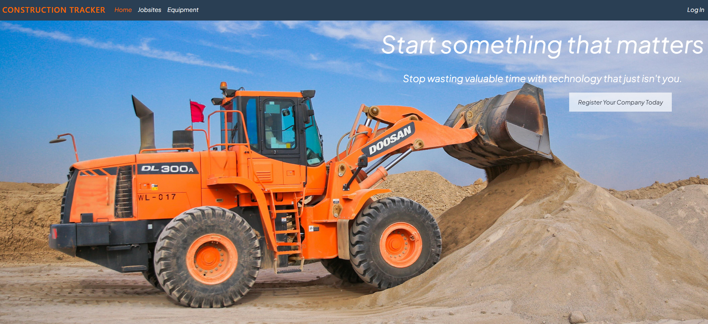
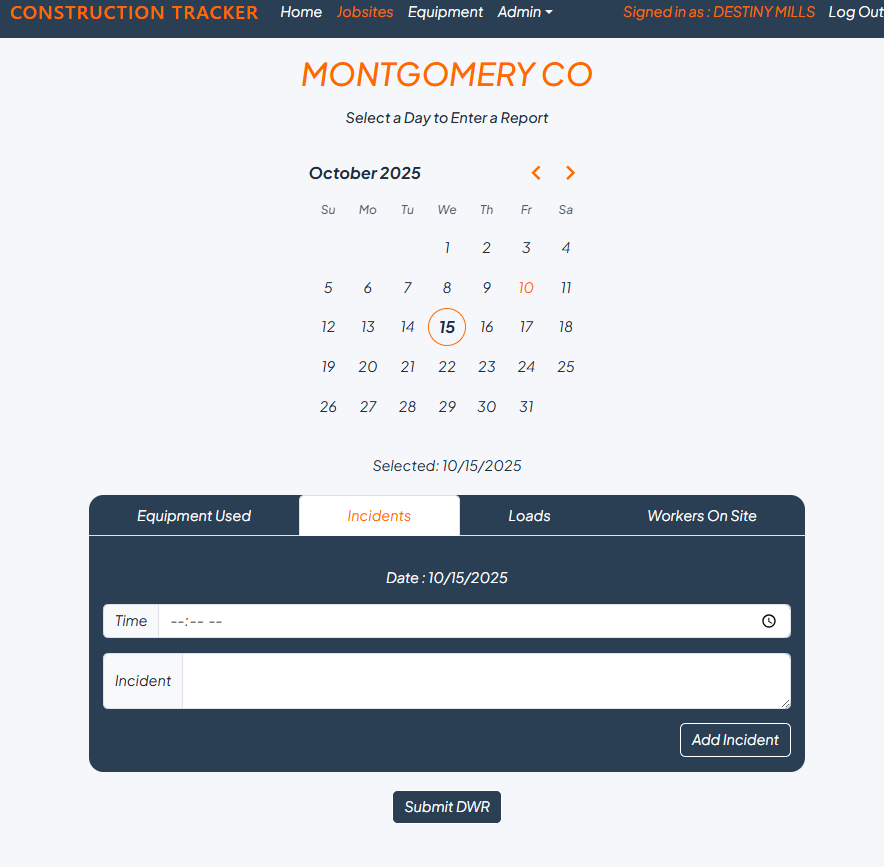
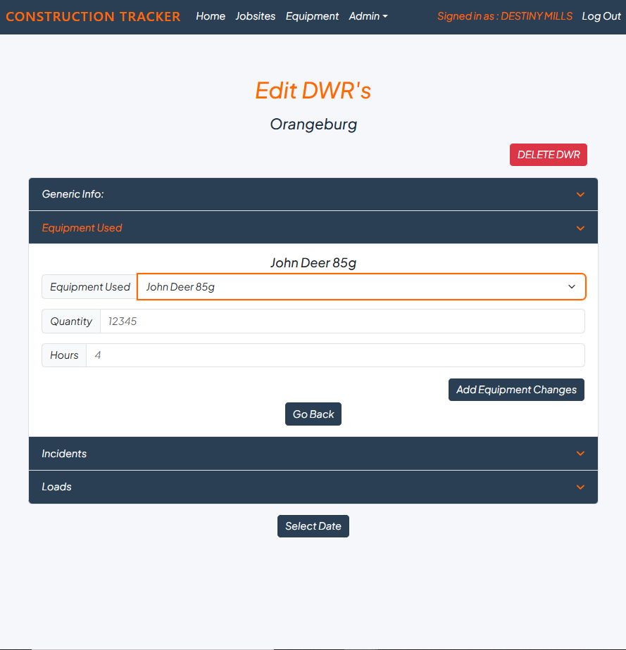

# Construction Tracker

**Construction Tracker** is a full-stack construction management application built to address real operational challenges faced by a local construction company. The platform allows field crews to log daily progress, labor hours, and job-specific metrics while providing administrators with centralized oversight and reporting tools.

The application includes secure authentication, role-based access control, and automated PDF report generation. While not currently in active production use, the system is fully production-ready and was developed in direct response to real-world business requirements.

---

## Features

- Secure authentication with protected routes
- Role-based access control (Admin vs Crew)
- Daily Work Report (DWR) entry system
- Jobsite and equipment tracking
- Automated PDF report generation
- Admin dashboard for data management
- Production-ready full-stack architecture

---

## Tech Stack

### Frontend
- React
- JavaScript
- Bootstrap (React)
- HTML
- CSS

### Backend
- Node.js
- Express.js
- MongoDB
- Mongoose

---

## Installation

### Step 1: Clone the repository
git clone https://github.com/destinyheather92/Capstone.git

### Step 2: Navigate to the project directory
cd Capstone

### Step 3: Install dependencies
npm install
cd server
npm install
cd ..
cd client
npm install
cd ..

---

## Usage

### Start the development servers
npm start

### Open the application
http://localhost:5173

---

## Application Overview

### Home
The public landing page where companies can register. All other routes are protected and require authentication.

### Jobs / Daily Work Reports
Displays all jobsites associated with a company. Users must select both a job and a date before entering data. After submission, the form resets to prevent data overwrites and ensure reporting accuracy.

### Admin Dashboard
Administrators can:
- Create and edit jobsites
- Add and manage equipment
- Edit Daily Work Reports
- Manage employee accounts
- Update user profiles

---

## Reporting

### PDF Generation
Daily Work Reports can be exported as PDFs using **PDFKit**. Reports are generated dynamically based on the selected jobsite and date, making it easy for supervisors to download and share end-of-day summaries.

---

## Configuration

- No API keys are required to run this application.

---

## Contributing

Contributions are welcome. Please submit a pull request if you would like to add features, improve functionality, or fix bugs.

---

## Credits & Acknowledgements

- **Persevere Coding Boot Camp**
- Mentors and peers (special thanks to Mr. Miller)
- The open-source community for libraries, tools, and documentation

---

## License

This project is licensed under the **MIT License**.
See the [LICENSE](LICENSE) file for more information.
